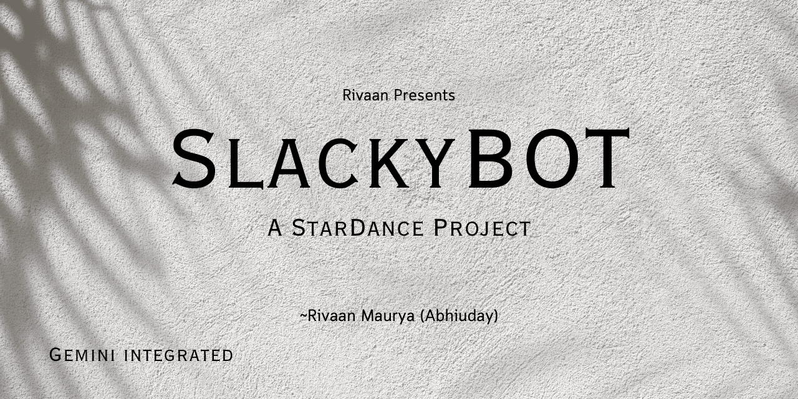
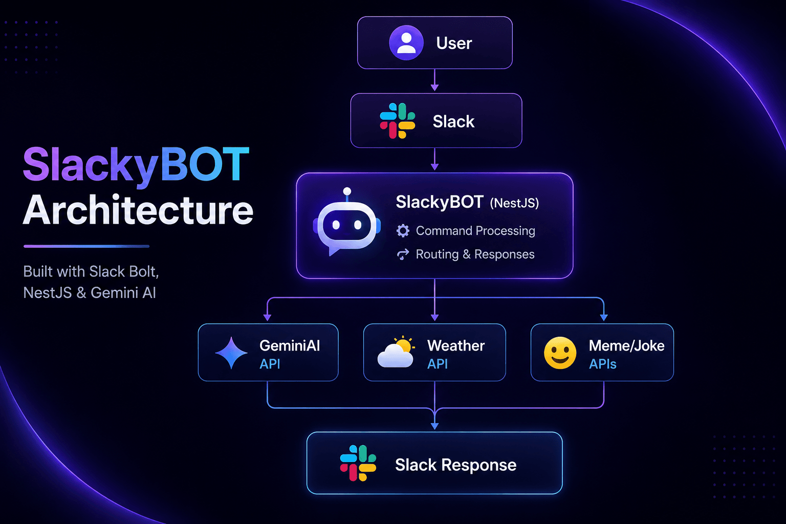
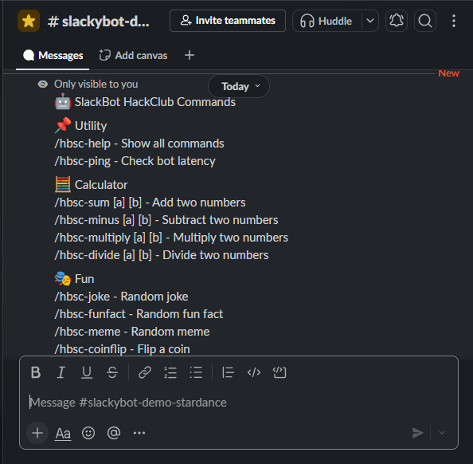
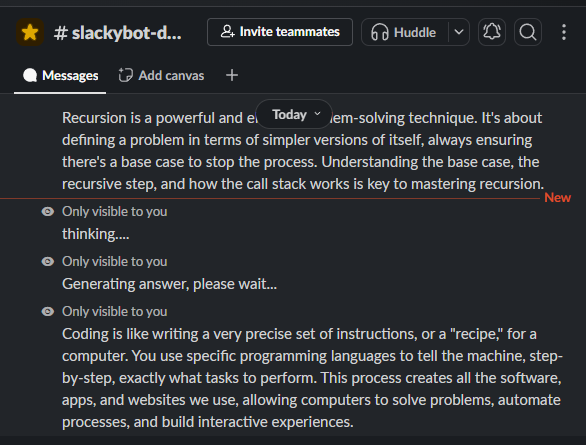
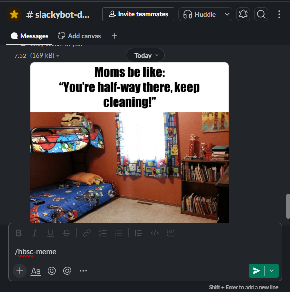

# <p align="center">

  
  SlackyBOT
</p>

<p align="center">
  
</p>
<p align="center">
  
</p>

SlackyBOT is a feature-rich Slack bot built with **Node.js**, **Slack Bolt**, and **Google Gemini API**. It combines productivity tools, AI-powered assistance, weather information, calculators, and fun commands into a single Slack experience.

Built as part of the **StarDance Hack Club** challenge.

---

## ✨ Features

### 🤖 AI Assistant

- Ask questions directly from Slack using Google Gemini AI.
- Get instant AI-generated responses without leaving your workspace.

### 🌤 Weather Reports

- Search weather information for any city.
- Includes:
  - Temperature
  - Feels-like temperature
  - Humidity
  - Wind speed
  - Day/Night status
  - Weather advice

### 🧮 Calculator Utilities

- Addition
- Subtraction
- Multiplication
- Division

### 🎭 Fun Commands

- Random jokes
- Random fun facts
- Random memes
- Coin flips

### ⚡ Utility Commands

- Help command
- Ping/latency checker

---

---

## 🏗 Architecture

<p align="center">
  
</p>

SlackyBOT receives commands from Slack, routes requests to the appropriate API, and returns formatted responses directly inside the Slack workspace.

---

## 📸 Command Previews

### 📋 Help Command



### 🤖 Gemini AI Response



### 🌤 Weather Report

<p align="center">
  
</p>

### 🎭 Meme Generator

<p align="center">
  
</p>

### 🧠 AI Assistant Demo

<p align="center">
  
</p>

### 😂 Meme Response Example



## 📋 Available Commands

| Command                   | Description                    |
| ------------------------- | ------------------------------ |
| `/hbsc-help`              | Display all available commands |
| `/hbsc-ping`              | Check bot latency              |
| `/hbsc-sum <a> <b>`       | Add two numbers                |
| `/hbsc-minus <a> <b>`     | Subtract two numbers           |
| `/hbsc-multiply <a> <b>`  | Multiply two numbers           |
| `/hbsc-divide <a> <b>`    | Divide two numbers             |
| `/hbsc-joke`              | Get a random joke              |
| `/hbsc-funfact`           | Get a random fun fact          |
| `/hbsc-meme`              | Generate a random meme         |
| `/hbsc-coinflip`          | Flip a coin                    |
| `/hbsc-weather <city>`    | Get weather information        |
| `/hbsc-gemini <question>` | Ask Gemini AI                  |

---

## 🌐 Live Demo & Testing

A public demo workspace is available for testing SlackyBOT.

### Demo Website

https://abhiudaymaurya.github.io/Slack-Bot/

### How to Test

1. Open the demo website.
2. Click **Join Demo Workspace**.
3. Join the Slack workspace using your Slack account.
4. Open the **#slackybot-demo-stardance** channel.
5. Try the available slash commands:

```txt
/hbsc-help
/hbsc-weather london
/hbsc-gemini explain recursion
/hbsc-joke
/hbsc-funfact
/hbsc-meme
/hbsc-coinflip
```

### You can also test any command listed in the Commands section above.

### Notes

- Responses are visible only to the user who runs the command.
- AI responses are powered by Google Gemini.
- Weather data is provided by Open-Meteo.
- The demo is hosted on Nest provided by Hack Club.
- AI and weather responses may occasionally be delayed or unavailable due to free API usage limits.

Happy testing! 🚀

---

## 🚀 Installation

### 1. Clone the repository

```bash
git clone https://github.com/Abhiudaymaurya/Slack-Bot.git
cd Slack-Bot
```

### 2. Install dependencies

```bash
npm install
```

### 3. Configure environment variables

Create a `.env` file:

```env
SLACK_BOT_TOKEN=your_bot_token
SLACK_APP_TOKEN=your_app_token
GEMINI_API_TOKEN=your_gemini_api_token
```

### 4. Start the bot

```bash
npm start
```

---

## 🛠 Built With

- Node.js
- Slack Bolt
- Google Gemini AI
- Axios
- Open-Meteo API
- Meme API
- Official Joke API

---

## 🤝 Contributing

Contributions are welcome!

If you'd like to improve SlackyBOT, feel free to:

- Report bugs
- Suggest new features
- Improve documentation
- Refactor or optimize code
- Add new Slack commands and integrations

### Getting Started

1. Fork the repository
2. Create a new branch

```bash
git checkout -b feature/my-feature
```

3. Commit your changes

```bash
git commit -m "Add my feature"
```

4. Push to your fork

```bash
git push origin feature/my-feature
```

5. Open a Pull Request

Please ensure your code follows existing project conventions and includes clear commit messages.

Every contribution helps make SlackyBOT better. 🚀

---

## 🎯 Project Goals

This project was created to learn:

- Slack Bot Development
- API Integration
- AI Integration
- Error Handling
- Async JavaScript
- Real-world Backend Development

---

## 🙏 Credits

- Google Gemini Documentation
- Slack Bolt Documentation
- Open-Meteo API
- Meme API
- Official Joke API
- StarDance Hack Club

---

---

## 🎬 Live Demonstrations

- Gemini AI Integration
- Weather Reports
- Meme Generation
- Interactive Slash Commands
- Slack Workspace Automation

## 🚀 Future Plans

- Better Slack UI Blocks
- AI Image Features
- User Preferences
- More Useful Utility Commands

---

---

## 📝 AI Usage Disclosure

This project's source code, application logic, command implementation, and overall architecture were designed and developed by **Abhiuday Maurya (Rivaan Maurya)**.

AI tools were used only as development assistants for:

- Learning concepts
- Generating a small number of visual assets, including the architecture diagram and promotional images

All final implementation, integration, testing, configuration, and project decisions were completed by the author.

This project was built using official documentation, including:

- Slack Bolt Documentation
- Google Gemini Documentation
- Open-Meteo Documentation
- Node.js Documentation

AI-generated assets are used solely for presentation and documentation purposes and are not part of the application's core functionality.

---

## Made by Rivaan Maurya (Abhiuday Maurya)

## 📄 License

This project is licensed under the MIT License.
